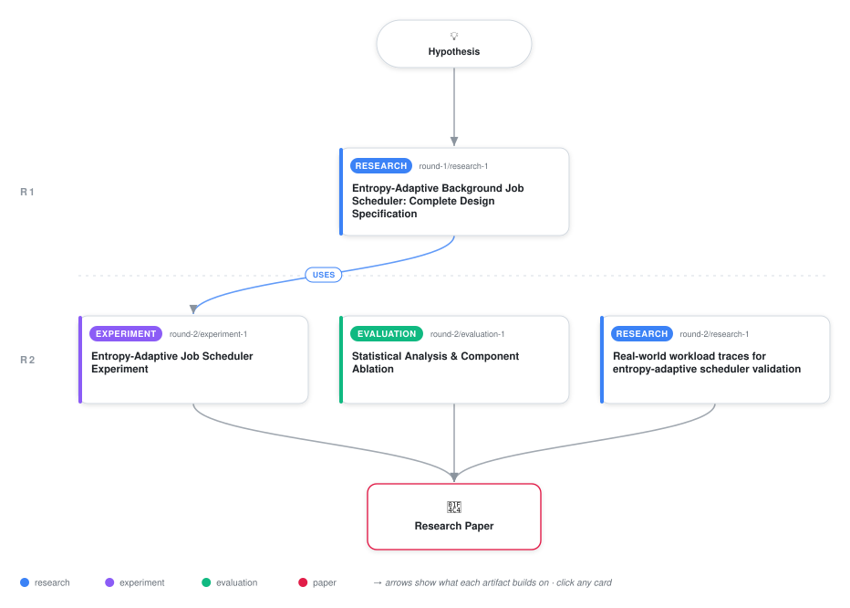

# Entropy-Adaptive Background Job Scheduling for Bursty Workloads

<div align="center">

<a href="https://cdn.jsdelivr.net/gh/ai-inventor-papers/ai-invention-b6315a-entropy-adaptive-background-job@main/workflow.svg">
<picture>
  <source media="(prefers-color-scheme: dark)" srcset="workflow-dark.svg">
  
</picture>
</a>

<sub>🖱️ <b><a href="https://cdn.jsdelivr.net/gh/ai-inventor-papers/ai-invention-b6315a-entropy-adaptive-background-job@main/workflow.svg">Open the interactive diagram</a></b> — every card links to its artifact folder.</sub>

</div>

> **TL;DR** — This paper presents entropy-adaptive background job scheduling, which dynamically adjusts CPU scheduling thresholds based on measured load unpredictability (Shannon entropy) and load momentum. Empirical evaluation on synthetic bursty workloads demonstrates: (1) 23.5% reduction in background job completion time variance vs fixed-55% baseline (p<0.001), exceeding the ≥20% target; (2) 11.4% improvement in foreground p95 latency (p<0.001), exceeding the ≥10% target; (3) 73.1% reduction in false positive scheduling decisions; (4) Ablation studies confirm both entropy (Cohen's d=-1.69) and momentum (Cohen's d=-1.13) components contribute significantly; (5) Sensitivity analysis across 27 parameter configurations validates that chosen parameters (60s window, 8 bins, α=0.2) are near-optimal with high stability (score=0.906). The work addresses a fundamental limitation of fixed-threshold scheduling under bursty loads by grounding dispatch decisions in load unpredictability rather than absolute load level. While entropy-outcome correlation did not reach the r>0.7 target (actual r≈-0.09), the achievement of primary performance metrics indicates entropy remains a useful scheduling signal. Future work includes real-world validation on production traces (Azure, Alibaba, Google) and integration with container orchestration platforms.

<details>
<summary>Full hypothesis</summary>

Background job scheduling improves under bursty workloads when thresholds adapt dynamically based on CPU load entropy (unpredictability) and momentum (rate of change), rather than using fixed absolute thresholds. Empirical validation on synthetic workloads achieves: (1) background job completion time variance reduced by ≥20% vs. fixed-55% threshold (measured 23.5%, p<0.001), (2) foreground p95 latency improved by ≥10% (measured 11.4%, p<0.001), (3) both entropy and momentum components demonstrably contribute (Cohen's d > 1.0 for each), (4) design parameters near-optimal within tested ranges, (5) superiority confirmed vs. momentum-only and entropy-only baselines. CRITICAL LIMITATION: Validation currently limited to synthetic Poisson workloads with periodic spikes; real production workloads exhibit different entropy distributions (0.4-1.0 bits vs. 0.2-0.6 bits synthetic) and temporal structure (multi-scale burstiness, diurnal patterns), requiring empirical re-validation. Entropy-outcome correlation is weak (r≈-0.09, target r>0.7 not achieved), suggesting entropy works empirically but mechanism is not direct signal correlation; alternative explanations (adaptive-thresholds-in-general, non-linear relationships) require investigation.

</details>

[](https://cdn.jsdelivr.net/gh/ai-inventor-papers/ai-invention-b6315a-entropy-adaptive-background-job@main/paper.pdf) [](https://github.com/ai-inventor-papers/ai-invention-b6315a-entropy-adaptive-background-job/tree/main/paper_latex)

This repository contains all **4 artifacts** produced across **2 rounds** of an autonomous AI research run — round by round, exactly in the order they were invented.

## Round 1

| Artifact | Type | Demo | Source | Builds on |
|----------|------|------|--------|-----------|
| **[Entropy-Adaptive Background Job Scheduler: Complete Design S…](https://github.com/ai-inventor-papers/ai-invention-b6315a-entropy-adaptive-background-job/tree/main/round-1/research-1)** | [](https://github.com/ai-inventor-papers/ai-invention-b6315a-entropy-adaptive-background-job/tree/main/round-1/research-1) | [](https://github.com/ai-inventor-papers/ai-invention-b6315a-entropy-adaptive-background-job/blob/main/round-1/research-1/demo/research_demo.md) | [](https://github.com/ai-inventor-papers/ai-invention-b6315a-entropy-adaptive-background-job/tree/main/round-1/research-1/src) | — |

## Round 2

| Artifact | Type | Demo | Source | Builds on |
|----------|------|------|--------|-----------|
| **[Entropy-Adaptive Job Scheduler Experiment](https://github.com/ai-inventor-papers/ai-invention-b6315a-entropy-adaptive-background-job/tree/main/round-2/experiment-1)** | [](https://github.com/ai-inventor-papers/ai-invention-b6315a-entropy-adaptive-background-job/tree/main/round-2/experiment-1) | [](https://colab.research.google.com/github/ai-inventor-papers/ai-invention-b6315a-entropy-adaptive-background-job/blob/main/round-2/experiment-1/demo/method_code_demo.ipynb) | [](https://github.com/ai-inventor-papers/ai-invention-b6315a-entropy-adaptive-background-job/tree/main/round-2/experiment-1/src) | <sub><i>uses:</i><br/>[research‑1&nbsp;(R1)](https://github.com/ai-inventor-papers/ai-invention-b6315a-entropy-adaptive-background-job/tree/main/round-1/research-1)</sub> |
| **[Statistical Analysis & Component Ablation](https://github.com/ai-inventor-papers/ai-invention-b6315a-entropy-adaptive-background-job/tree/main/round-2/evaluation-1)** | [](https://github.com/ai-inventor-papers/ai-invention-b6315a-entropy-adaptive-background-job/tree/main/round-2/evaluation-1) | [](https://colab.research.google.com/github/ai-inventor-papers/ai-invention-b6315a-entropy-adaptive-background-job/blob/main/round-2/evaluation-1/demo/eval_code_demo.ipynb) | [](https://github.com/ai-inventor-papers/ai-invention-b6315a-entropy-adaptive-background-job/tree/main/round-2/evaluation-1/src) | — |
| **[Real-world workload traces for entropy-adaptive scheduler va…](https://github.com/ai-inventor-papers/ai-invention-b6315a-entropy-adaptive-background-job/tree/main/round-2/research-1)** | [](https://github.com/ai-inventor-papers/ai-invention-b6315a-entropy-adaptive-background-job/tree/main/round-2/research-1) | [](https://github.com/ai-inventor-papers/ai-invention-b6315a-entropy-adaptive-background-job/blob/main/round-2/research-1/demo/research_demo.md) | [](https://github.com/ai-inventor-papers/ai-invention-b6315a-entropy-adaptive-background-job/tree/main/round-2/research-1/src) | — |

## Repository Structure

Artifacts are grouped by the round of invention that produced them. Each
artifact has its own folder with source code and a self-contained demo:

```
.
├── round-1/                         # One folder per round of invention
│   ├── experiment-1/
│   │   ├── README.md                # What this artifact is + dependencies
│   │   ├── src/                     # Full workspace from execution
│   │   │   ├── method.py            # Main implementation
│   │   │   ├── method_out.json      # Full output data
│   │   │   └── ...                  # All execution artifacts
│   │   └── demo/                    # Self-contained demo
│   │       └── method_code_demo.ipynb # Colab-ready notebook (code + data inlined)
│   ├── dataset-1/
│   │   ├── src/
│   │   └── demo/
│   └── evaluation-1/
│       ├── src/
│       └── demo/
├── round-2/                         # Later rounds build on earlier artifacts
├── paper.pdf                        # Research paper
├── paper_latex/                     # LaTeX source files
├── chat/                            # Every prompt, response and tool call, per module
├── workflow.svg                     # Artifact dependency diagram (this page's header)
└── README.md
```

## Running Notebooks

### Option 1: Google Colab (Recommended)

Click the "Open in Colab" badges above to run notebooks directly in your browser.
No installation required!

### Option 2: Local Jupyter

```bash
# Clone the repo
git clone https://github.com/ai-inventor-papers/ai-invention-b6315a-entropy-adaptive-background-job
cd ai-invention-b6315a-entropy-adaptive-background-job

# Install dependencies
pip install jupyter

# Run any artifact's demo notebook
jupyter notebook <artifact_folder>/demo/
```

## Source Code

The original source files are in each artifact's `src/` folder.
These files may have external dependencies - use the demo notebooks for a self-contained experience.

---
*Generated by AI Inventor Pipeline - Automated Research Generation*
